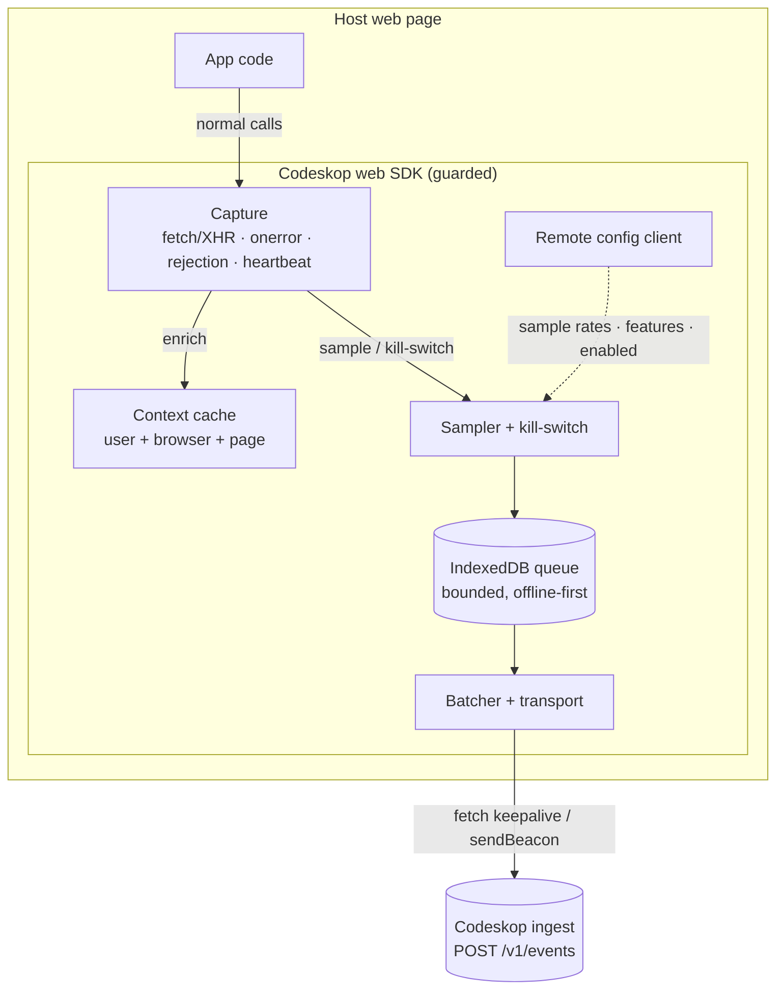
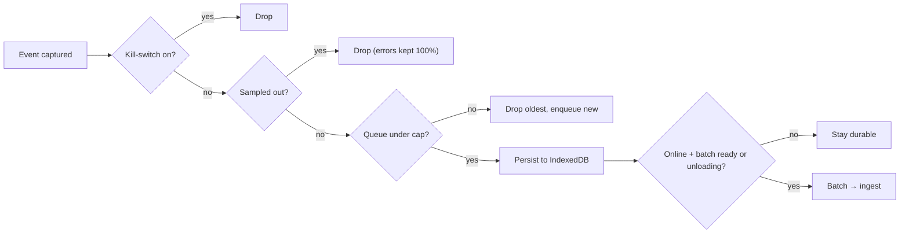

# 2. Web SDK — Architecture

> How `@codeskop/tracker` is structured and how an event flows from capture to the
> backend. Mirrors the Android runtime architecture
> ([`android/docs/02`](../../android/docs/02-architecture.md)) with browser-appropriate
> primitives.

## 2.1 Package layout

```
@codeskop/tracker            (core — zero deps, tree-shakeable)
  ├─ model/            event + envelope types (the §7.5 wire shape)
  ├─ core/             id-gen, redaction, fingerprint, sampling, state machine
  ├─ queue/            IndexedDB durable queue (+ in-memory fallback)
  ├─ transport/        envelope builder, gzip, fetch/sendBeacon delivery, backoff
  ├─ config/           GET /v1/config client + last-known-good cache
  ├─ capture/          fetch/XHR instrumentation, error/rejection handlers, heartbeat
  └─ Codeskop          the public facade (guarded entrypoints)

@codeskop/tracker-react      (adapter — depends on react only)
  └─ ErrorBoundary + provider/hook
```

The core has **no framework dependency** and no bundler-specific magic; adapters are
separate entry points so a vanilla consumer never pays for React.

## 2.2 Why a framework-free core

The same core is intended to sit under a React boundary, a Vue plugin, or a plain
`<script>` include. Keeping DOM/global access behind small seams (storage, clock,
fetch) also lets the logic modules run under Vitest in Node with no browser, so the
bulk of the tests are milliseconds-fast — the web equivalent of the KMP core compiling
to the JVM for tests.

## 2.3 Runtime flow



**Thread model.** Everything runs on the main thread but off the critical path: capture
hooks copy a few fields synchronously and hand off; enqueue, batch, gzip, and send are
deferred (microtask / `requestIdleCallback`). A Web Worker is *not* required for v1 (the
work is tiny); it's a later option if profiling ever demands it.

## 2.4 Delivery & the unload problem

The browser's hard problem is the page closing mid-flight. Two mechanisms:

- **Steady state:** `fetch(url, { keepalive: true })` on batch-size/time/`online` triggers.
- **On the way out:** `visibilitychange → hidden` and `pagehide` flush the queue via
  **`navigator.sendBeacon`**, which the browser delivers even as the page unloads.

Acked batches are deleted; a `5xx`/network failure leaves them in IndexedDB to retry on
the next load (offline-first by construction, since the queue is durable).

## 2.5 Two-layer footprint defense



Errors/rejections are never sampled out; everything else is rate-limited and the queue
is byte-capped, so the SDK has a **bounded** worst case regardless of page behavior.

## 2.6 Platform seams (testability)

Small injectable seams keep logic pure and browser-independent:

| Seam | Production | Test |
|------|-----------|------|
| Clock | `Date.now()` | fixed millis |
| Storage | IndexedDB / `localStorage` | in-memory fake |
| Transport | `fetch` / `sendBeacon` | recording fake / mock server |
| Config source | `GET /v1/config` | canned config |

This is the web mirror of the Android `expect/actual` platform seam.
