# Web SDK Build & Release Workflow (`@codeskop/tracker`)

> The single, tracked, gated plan to build the Codeskop **web** SDK from an empty
> `development` branch all the way to a **published, licensed, production-grade**
> browser library — the web counterpart to the Android SDK
> ([`android/docs/10`](../android/docs/10-sdk-build-workflow.md) +
> [`11`](../android/docs/11-sdk-production-readiness.md)), collapsed into one workflow
> so web and mobile can reach release together.
>
> This is a *working tracker*: phases complete in order, each gated by an exit
> checkbox. **Do not start a phase until the previous phase's gate is checked.** When
> every gate here is checked, the web SDK is published to the private registry and
> installable by any *licensed* customer with one dependency line.

- **Owner:** Web SDK team
- **Package:** `@codeskop/tracker` (TypeScript, ESM + CJS + types, built with **tsup**).
- **Backend contract:** the **same** ingest contract the Android SDK and backend share
  — [`backend/docs/07` §7.5](../backend/docs/07-mobile-sdk-ingest-readiness.md#75-the-locked-contract-build-to-this)
  (`POST /v1/events`, `GET /v1/config`). The web SDK is a new client of an existing,
  shipped contract.
- **Reference docs:** [`docs/01-blueprint-and-decisions`](./docs/01-blueprint-and-decisions.md) ·
  [`02-architecture`](./docs/02-architecture.md) · [`03-capture-and-event-model`](./docs/03-capture-and-event-model.md) ·
  [`04-security-and-licensing`](./docs/04-security-and-licensing.md) · [`05-api-reference`](./docs/05-api-reference.md) ·
  [`06-integration-guide`](./docs/06-integration-guide.md)
- **Decision log:** [`docs/01-blueprint-and-decisions` §1.5](./docs/01-blueprint-and-decisions.md#15-decision-log) (D1–D11)

## How to use this document

1. Work **top to bottom**. Phase _N+1_ may not begin until Phase _N_'s **Exit gate**
   is checked.
2. Tick task checkboxes as work lands; tick the **Exit gate** only when every task is
   done **and** the acceptance check passes.
3. Update the **Progress tracker** when a phase flips state.
4. Every phase carries its module's definition of done: tests written first → code
   passes → coverage ≥ 80% on logic → bundle-size budget met.

Status legend: ⬜ not started · 🔄 in progress · ✅ complete

## Git workflow (per phase)

Mirrors the Android SDK discipline. For each phase: branch
**`web-sdk-workflow-phase<N>`** from the latest `development`, implement, **verify
(unit + integration/e2e tests + bundle budget)**, commit, push, open a PR to
`development`. A merge is allowed only when CI is green and thresholds pass; the
owner merges, and the next phase branches from the updated `development`.

## What "released" means here

| Dimension | Bar |
|-----------|-----|
| **Functional** | Captures JS errors, unhandled rejections, `fetch`/XHR failures + latency, and heartbeats; offline-durable; validated against the mock then the real backend |
| **Small** | Tree-shakeable ESM; core gzipped bundle within budget (see `docs/01` §1.4) |
| **Secure** | Public ingest key only (`cs_*_pk_…`, never the secret); origin-bound; redaction enforced; remote kill-switch |
| **Licensed (not free)** | Private scoped package; install gated by a subscription-tied token; runtime plan gating (D11) |
| **Stable API** | Public API frozen, SemVer, `.d.ts` API report checked in CI |
| **Operable** | Release pipeline (tag → publish), SDK-health telemetry, kill-switch drill, runbooks |
| **Documented** | Quickstart + framework + troubleshooting; changelog |

## Scope — in and out

| In scope | Out of scope (later) |
|----------|----------------------|
| Browser (evergreen) ESM + CJS; TypeScript types | Legacy IE; React-Native (covered by mobile) |
| Vanilla core + a React adapter | Vue/Angular/Svelte adapters (fast-follow) |
| Same `POST /v1/events` + `GET /v1/config` contract | Any new backend contract changes |
| Private, licensed npm distribution | Public/free distribution |

## Progress tracker

| Phase | Title | Gate | Status |
|-------|-------|------|--------|
| 0 | Foundation: tooling, CI, coverage & bundle-size gates, mock | ✅ | ✅ |
| 1 | Core domain model & policies | ✅ | ✅ |
| 2 | Durable queue (IndexedDB) | ✅ | ✅ |
| 3 | Transport, envelope & batching | ✅ | ✅ |
| 4 | Browser runtime & sync | ✅ | ✅ |
| 5 | Identity & key handling | ✅ | ✅ |
| 6 | Network capture (`fetch` + XHR) | ✅ | ✅ |
| 7 | Error & unhandled-rejection capture | ✅ | ✅ |
| 8 | Remote config & kill-switch client | ✅ | ✅ |
| 9 | Presence heartbeat | ✅ | ✅ |
| 10 | End-to-end vs mock + coverage/bundle gate | ✅ | ✅ |
| 11 | Real backend integration (staging → production) | ⬜ | 🔄 |
| 12 | React adapter | ✅ | ✅ |
| 13 | API freeze, security & privacy review, SBOM | ✅ | ✅ |
| 14 | Private packaging & licensed publishing | ⬜ | ⬜ |
| 15 | Release engineering, docs & GA operations | 🟡 | 🔄 |

**Released for licensed customers = all sixteen gates ✅.**

---

## Phase 0 — Foundation: tooling, CI, coverage & bundle-size gates, mock

**Goal:** the scaffold builds and publishes types, CI runs every check, and the 80%
coverage gate + gzipped bundle-size budget are merge-blocking. (D4)

- [ ] `package.json` for `@codeskop/tracker` (private scoped, `"private"` until Phase 14;
      `type: module`; `exports` map for ESM/CJS/types; `sideEffects:false` for tree-shaking).
- [ ] **tsup** build → ESM + CJS + `.d.ts`; strict `tsconfig`.
- [ ] ESLint + Prettier; **Vitest** (unit) with coverage; **Playwright** (browser e2e) wired.
- [ ] Bundle-size gate (`size-limit`) with a budget per `docs/01` §1.4, merge-blocking.
- [ ] CI (`.github/workflows/ci.yml`): `lint → typecheck → test (coverage ≥ 80%) →
      build → size-limit`, all blocking on PRs to `development`.
- [ ] Reuse the backend **mock ingest server** (`backend/mock-ingest-server/`) as the
      local `POST /v1/events` + `GET /v1/config` target for tests.

**Exit gate** — ⬜ CI green and enforcing the 80% coverage + bundle-size budgets; the
mock accepts a hand-crafted batch and returns contract responses.
> **Do not proceed to Phase 1 until this gate is checked.**

---

## Phase 1 — Core domain model & policies

**Goal:** the platform-agnostic brain, fully unit-tested, with no DOM/browser globals.
(D3, D8)

- [ ] Event model + TS types, aligned to the §7.5 envelope (`event_id`, `type`,
      `occurred_at`, `severity`, `user`, `payload`; batch-level `context`).
- [ ] `event_id` generation (UUIDv7).
- [ ] Redaction: strip `Authorization`/`Cookie`; mask configured query keys; redact
      error messages by default.
- [ ] Fingerprinting parity with the backend (templated URL paths; stack-frame hashing)
      — see `docs/03`.
- [ ] Sampling policy (errors always kept at 100%; `api_timing` sampled per config).
- [ ] Client state machine (uninitialized / enabled / disabled / killed).
- [ ] Unit tests per policy; coverage ≥ 80%.

**Exit gate** — ⬜ Core compiles with zero browser globals; all policy tests green;
coverage ≥ 80%.
> **Do not proceed to Phase 2 until this gate is checked.**

---

## Phase 2 — Durable queue (IndexedDB)

**Goal:** an offline-first, bounded queue that survives reloads and tab close. (D8)

- [ ] IndexedDB-backed store (with an in-memory fallback where IDB is unavailable).
- [ ] Enqueue / peek-batch / ack, off the main thread's critical path.
- [ ] Byte cap with drop-oldest and a reserved slice for critical (error) events.
- [ ] Idempotency: duplicate `event_id` is a no-op insert.
- [ ] Resilience: a corrupt/undeserializable record is skipped + dropped, never wedges sync.
- [ ] Survives a full page reload (durability test in a real browser).
- [ ] Tests: cap enforcement, critical-reserve preservation, idempotency, reload.

**Exit gate** — ⬜ Queue enforces the cap, preserves errors under flood, dedups by
`event_id`, and survives reload; tests green.
> **Do not proceed to Phase 3 until this gate is checked.**

---

## Phase 3 — Transport, envelope & batching

**Goal:** batches are assembled per the contract and delivered with correct retry
semantics, including on page unload. (D8)

- [ ] Envelope builder: batch-level `context` (browser/app/page), per-event `user`,
      `sent_at`; ≤ 100 events, ≤ 64 KB/event, ≤ 1 MB compressed.
- [ ] gzip via `CompressionStream` where available (uncompressed fallback otherwise).
- [ ] Delivery via `fetch` (keepalive) on flush, and **`navigator.sendBeacon`** on
      `visibilitychange`/`pagehide` so in-flight events aren't lost on close.
- [ ] Delivery semantics: `2xx` → ack+delete; `4xx` → drop/dead-letter; `5xx`/network →
      exponential backoff; honour `{ "rejected": [...] }`.
- [ ] Bearer auth header carries the public key (`cs_*_pk_…`); origin sent for D10.
- [ ] Tests against the mock: happy path, partial reject, transient retry, oversize, beacon-on-unload.

**Exit gate** — ⬜ A queued batch reaches the mock, is acked, and deleted; unload flush
works; all failure modes behave per the contract; tests green.
> **Do not proceed to Phase 4 until this gate is checked.**

---

## Phase 4 — Browser runtime & sync

**Goal:** the SDK initializes cheaply and drains the queue on the right triggers. (D1)

- [ ] `init(config)` (explicit) + a lightweight auto-init via the script's data-attributes.
- [ ] Install-ID generation + persistence (`localStorage`, cookie fallback).
- [ ] Context collector (userAgent / UA-Client-Hints, locale, screen, page URL+referrer,
      app version) read once at init; URL redacted per policy.
- [ ] Sync triggers: batch-size reached, time window, `online` event, and
      `visibilitychange → hidden` (beacon). Uses `requestIdleCallback` where possible.
- [ ] Never blocks the main thread meaningfully; no long tasks at init.
- [ ] Tests (Playwright): init cost tiny; events survive reload and flush on reconnect.

**Exit gate** — ⬜ Init is cheap; buffered events sync to the mock when connectivity
returns and on tab hide; tests green.
> **Do not proceed to Phase 5 until this gate is checked.**

---

## Phase 5 — Identity & key handling

**Goal:** stable user identity and safe credential handling. (D5, D7)

- [ ] `identify(userId, traits)` / `reset()` (repeat identify updates, never creates a
      new user — backend rule); anonymous attribution to the install ID before identify.
- [ ] Key validation at init: accept `cs_*_pk_…`; **reject** secret keys (`cs_*_sk_…`)
      fail-soft (disable + diagnostic), never throw into the host page.
- [ ] SDK sends only the key — no client-declared scopes (server enforces scope).
- [ ] Tests: identify/reset transitions, anonymous→identified inputs, secret-key rejection.

**Exit gate** — ⬜ Identity transitions correct; secret keys rejected safely; only the
key is on the wire; tests green.
> **Do not proceed to Phase 6 until this gate is checked.**

---

## Phase 6 — Network capture (`fetch` + XHR)

**Goal:** every `fetch`/`XMLHttpRequest` yields metadata + latency, guarded so it can
never break the host's request. (D3)

- [ ] Monkey-patch `window.fetch` and `XMLHttpRequest`: method, URL (query dropped),
      status, sizes, error kind → `api_error` on failures; `api_timing` per call.
- [ ] Timing from `PerformanceResourceTiming` (DNS/connect/TLS/TTFB/total) where exposed.
- [ ] Header capture = allowlisted + redacted (`Authorization` always stripped); **never
      instrument requests to the ingest endpoint itself** (no feedback loop).
- [ ] Guard so a hook failure surfaces the original response/rejection unchanged.
- [ ] Tests: success, 5xx, network error, redaction, self-ingest exclusion.

**Exit gate** — ⬜ One metadata + one timing signal per call; redaction enforced; hooks
never throw into the host; ingest calls excluded; tests green.
> **Do not proceed to Phase 7 until this gate is checked.**

---

## Phase 7 — Error & unhandled-rejection capture

**Goal:** uncaught errors and promise rejections are captured, offline-first. (D6)

- [ ] `window.addEventListener('error')` (incl. resource errors) + `'unhandledrejection'`,
      chained so existing host handlers still run (never swallow).
- [ ] Normalize stacks; redact messages by default; optional source-map note (Phase 15).
- [ ] `recordException(error, attributes)` handled-error path.
- [ ] Tests: induced error + rejection each produce one event; handler chaining verified;
      fault injection confirms hooks never break the page.

**Exit gate** — ⬜ Errors/rejections/handled exceptions captured once; chaining + guards
verified; tests green.
> **Do not proceed to Phase 8 until this gate is checked.**

---

## Phase 8 — Remote config & kill-switch client

**Goal:** the SDK fetches entitlements and honours the remote kill-switch. (D4, D9)

- [ ] Fetch `GET /v1/config` on launch (ETag-aware); cache last-known-good (`localStorage`).
- [ ] Apply `sample_rates`, `features` (gate capture paths), `max_queue_mb`.
- [ ] Honour `enabled:false` (kill-switch) — disable all capture without a redeploy.
- [ ] A config-fetch failure never blocks the SDK or the page (last-known-good / default).
- [ ] Global `safely()` guard verified around every entrypoint and hook.
- [ ] Tests: feature gating, kill-switch disables capture, fetch-failure fallback, guard swallows faults.

**Exit gate** — ⬜ Config gates features and the kill-switch disables capture; fetch
failures are safe; guards proven; tests green.
> **Do not proceed to Phase 9 until this gate is checked.**

---

## Phase 9 — Presence heartbeat

**Goal:** a minimal, visible-only heartbeat the backend derives presence from. (D2)

- [ ] Emit a low-severity `heartbeat` on an interval **only while the page is visible**
      (Page Visibility API); hidden/backgrounded tabs emit nothing.
- [ ] Heartbeat rides the normal batched sync (no separate connection, no socket).
- [ ] Tests: cadence while visible; silence when hidden; rides the batch.

**Exit gate** — ⬜ Visible-tab heartbeats flow via the normal batch; hidden tabs emit
none; tests green.
> **Do not proceed to Phase 10 until this gate is checked.**

---

## Phase 10 — End-to-end vs mock + coverage/bundle gate

**Goal:** the whole pipeline is proven in a real browser against the mock and meets the
quality bars.

- [x] Public facade finalized in `src/index.ts` per `docs/05-api-reference.md`: `init`
      (re-exported as-is), `identify`/`reset` (`core/identity.ts`), `recordException`
      (`capture/errors.ts`), `setEnabled` (a local pause/resume independent of the
      remote kill-switch), `flush(): Promise<boolean>` (expedited drain via the fetch
      transport). Every entrypoint is `safely()`-wrapped and a no-op before `init()`.
- [x] Playwright e2e in a headless browser: each action (fetch error, thrown error,
      rejection, heartbeat) → queued → synced → received by the mock with correct
      user/context (`e2e/pipeline.spec.ts`, introspecting the mock's `/__debug/received`
      per `backend/mock-ingest-server/server.py`).
- [x] Offline scenario: buffer offline, go online, all received, none duplicated.
- [x] Coverage ≥ 80% on logic (94.41% overall); gzipped bundle within budget (10.35 KB
      of 12 KB).
- [x] Stability pass: fault injection into a capture hook via a test double
      (`e2e/fixtures/entry.ts`'s `triggerFaultyResourceError`) — the page and the SDK
      both keep working; only the one faulted event is dropped.

**Exit gate** — ✅ Full pipeline validated in-browser against the mock; coverage + bundle
budgets met; stability pass green.
> **Do not proceed to Phase 11 until this gate is checked.**

---

## Phase 11 — Real backend integration (staging → production)

**Goal:** swap the mock for the real ingest backend and validate end-to-end. (D5, D8, D9)

> **Dependency:** requires the backend deployed and reachable — see
> [`backend/docs/08` Phase 5 (staging)](../backend/docs/08-backend-api-deployment.md) for
> `staging.api.codeskop.com` and Phase 6 for `api.codeskop.com`. Do not start until the
> staging endpoint is live.

- [x] Point a staging build at `https://staging.api.codeskop.com` with a real `cs_test_pk_` key.
      *(Minted via `POST /api/v1/auth/signup` — `cs_test_pk_Zkp1r0H6olOZE0Ht`, org
      "Web SDK Beta Smoketest"; low-privilege public key, safe to share per `docs/04`.)*
- [x] Verify auth, `POST /v1/events`, `GET /v1/config` entitlements + kill-switch, dedup,
      against the real service. *(`scripts/staging-smoke.mjs` — a standalone Node
      harness running the real built `dist/index.js` in a jsdom DOM against real
      staging, bypassing only browser-level CORS enforcement so the wire contract
      itself could be isolated and checked: `GET /v1/config` → `200` with
      `enabled/sample_rates/features/max_queue_mb`; `recordException` → `flush()` →
      `POST /v1/events` → `200`; `setEnabled(false)` suppresses capture (queue stays
      at 0, no request fires) and `setEnabled(true)` resumes it; a byte-identical
      replay of an already-accepted envelope (same `event_id`) → `200` again, matching
      the "2xx = accepted/deduped" contract. All 5 steps passed, exit 0.)* Clock-skew
      correction not separately re-verified against staging — it is pure client logic
      already covered by `src/transport/envelope.test.ts` and is not backend-observable
      from outside; no staging-specific risk identified.
- [x] Confirm **CORS**: real Chromium (`e2e/staging-smoke.spec.ts`, page served from a real
      local origin, zero same-origin proxying) now completes the full round-trip against
      staging with **zero** CORS/request failures (`requestFailures=[]`,
      `consoleErrors=[]`) after the backend's `IngestCorsMiddleware` fix (merged
      `backend` PR #16, `5c5a90323bc838ad91ac319a32f37a955956addd`, tagged `v0.3.1`,
      live on both staging and production). `OPTIONS /v1/events` returns
      `access-control-allow-origin` (echoed), `access-control-allow-methods`,
      `access-control-allow-headers`; no `Access-Control-Allow-Credentials`, matching
      the backend engineer's report. Re-verified independently this pass, not assumed
      from the report — `STAGING_TEST_KEY=cs_test_pk_Zkp1r0H6olOZE0Ht npx playwright
      test e2e/staging-smoke.spec.ts` → 1 passed.
- [ ] Confirm **origin *binding* (D10)**: the registered allowed-origins allowlist accepts
      the app origin and rejects others. **Still not possible — independently confirmed,
      not just repeating the backend report:** `backend/apps/accounts/models.py`'s
      `APIKey` has only `allowed_app_identities` (the *mobile* D10 binding —
      `{package_name, signing_cert_sha256}`); no `allowed_origins`/similar field exists.
      `backend/apps/dashboard_api/urls.py` + `views.py` expose only key **create** and
      **revoke** — no update/PATCH endpoint of any kind on a key. `v1/ui/src` has no
      "allowed origins" field anywhere in its key-management page
      (`src/app/(app)/settings/projects/[id]/keys/page.tsx`). There is currently **no
      way — API or dashboard — to configure a per-key origin allowlist**, so "allowed
      origin accepted / other origin rejected" cannot be exercised at all, let alone
      pass. This is a genuine, tracked backend gap (the web half of D10 was never
      built — matches the backend engineer's own finding), separate from the CORS fix
      above, which only controls whether a browser's own preflight lets a cross-origin
      call through in the first place.
- [x] Confirm `last_used_at` flips and the dashboard "first event landed" signal fires.
      Logged in via `POST /api/v1/auth/login` (staging) as the Phase-11 signup account,
      `GET /api/v1/projects/{project_id}/keys` before vs. after a fresh SDK-triggered
      event: `last_used_at` on `cs_test_pk_Zkp1r0H6olOZE0Ht` advanced from
      `2026-07-14T10:52:07Z` → `2026-07-14T10:54:29Z`, one throttle window
      (`LAST_USED_THROTTLE_SECONDS = 60` in `backend/apps/ingest/authentication.py`)
      after the triggering request — confirms both the write and the throttle design
      working as documented, not just a stale timestamp from an earlier run.
- [x] Repeat against production with a `cs_live_pk_` key (low-volume smoke).
      **`e2e/staging-smoke.spec.ts` is now parametrized over both targets**
      (`STAGING_TEST_KEY` / `PRODUCTION_TEST_KEY`); a real-Chromium run against
      `https://api.codeskop.com` passed (config fetch, event round-trip, kill-switch,
      dedup replay, zero CORS failures). **Important correction:** the
      `cs_live_pk_oT2Nje5Xlt35ZfgI` key minted earlier was returned by **staging's**
      `POST /api/v1/auth/signup` (its response includes both a `test_key` and a
      `production_key`, but both live in the staging database/org — "production"
      there names the *environment*, not the deployment). Confirmed with direct
      `GET /v1/config`: staging → `200`; production → `401
      {"detail":"Unknown API key."}`. It was never a valid production credential.
      Minted a real production key instead via
      `POST https://api.codeskop.com/api/v1/auth/signup` (org "Web SDK Beta Smoketest
      Prod") — `cs_live_pk_m6z3iBadLtV5p7F` — verified `200` on production
      `/v1/config` first, then used for the full Playwright run.
      `cs_live_pk_oT2Nje5Xlt35ZfgI` should be treated as dead, not as an
      untested-but-valid production key.

**Exit gate** — 🔄 **Substantially met, not flipped to done.** Re-verified for real
after the backend CORS fix (PR #16, `5c5a90323bc838ad91ac319a32f37a955956addd`,
`v0.3.1`, live on staging + production), not assumed from the report:
`e2e/staging-smoke.spec.ts` passes in a real Chromium browser against both
`https://staging.api.codeskop.com` (`cs_test_pk_Zkp1r0H6olOZE0Ht`) and
`https://api.codeskop.com` (`cs_live_pk_m6z3iBadLtV5p7F`, freshly minted — the
previously-issued `cs_live_pk_oT2Nje5Xlt35ZfgI` turned out to be a staging-only key
mislabeled "production", see above), with zero CORS/request failures on either. The
dashboard reflects real traffic (`last_used_at` advances by exactly one throttle
window after a triggering event). **What keeps this from being ✅:** the
web-origin-*allowlist* half of D10 (server-side enforcement of "this key only
accepts requests from these registered origins") has no implementation anywhere in
the backend — no model field, no create/update param, no dashboard UI — so it
cannot be configured or exercised today. This is a pre-existing gap against the
original D10 design, not something introduced or masked by today's fix; the CORS
half (whether a browser's preflight is let through at all) is fully verified.
**To flip this gate to ✅:** the backend needs an `allowed_origins`-style field on
`APIKey`, a way to set it (key-update endpoint and/or dashboard UI), and enforcement
in `IngestKeyAuthentication`/`IngestCorsMiddleware` — then a repeat of this pass's
origin-binding check (configure an allowlist on the test key, confirm the allowed
origin succeeds and another origin is rejected).
> **Do not proceed to Phase 12 until this gate is checked.**

---

## Phase 12 — React adapter

**Goal:** first-class React integration.

- [x] `@codeskop/tracker-react`: a **second, minimal package folder** (`react/`), not a
      subpath export — matches `docs/02` §2.1's package-layout diagram and `docs/05`
      §5.5's documented package name, and Phase 14 already plans to publish it
      separately. Wired as an npm workspace (root `package.json`'s new `"workspaces"`
      field) with a `file:..`/`file:.` local dependency on `@codeskop/tracker` (no
      registry publish needed pre-Phase 14); own `tsup`/`vitest`/`eslint`(inherited)/
      `tsconfig` per `react/`. Exports `CodeskopProvider`, `CodeskopErrorBoundary`,
      `useCodeskop`, and `CodeskopContext` (`react/src/index.ts`). The **core stays
      dependency-free**: `dependencies: {}` in the root `package.json` is untouched;
      only `react/package.json` depends on `react` (`peerDependencies`) — a vanilla
      `@codeskop/tracker` consumer's install is unaffected.
      - `CodeskopProvider` (`react/src/CodeskopProvider.tsx`): calls `init(config)`
        once, inside a `useEffect` on mount — `config` is captured via `useRef` on
        first render, so a fresh inline `config={{ ... }}` object on every re-render
        never re-triggers `init()`.
      - `CodeskopErrorBoundary` (`react/src/CodeskopErrorBoundary.tsx`): a class
        component (error boundaries have no Hook form); `componentDidCatch` reports
        via `recordException(error, { source: 'react-error-boundary', componentStack })`
        (imported directly from the core, not through context — it's a safe no-op
        singleton either way, and a class component can't call a Hook); `fallback`
        prop accepts a fixed node or a `(error, reset) => node` function.
      - `useCodeskop()` (`react/src/useCodeskop.ts` + `context.ts`): reads
        `CodeskopContext`, whose *default* value is the real
        `recordException`/`identify`/`reset`/`setEnabled`/`flush` singletons — so the
        hook is safe to call with **no** `CodeskopProvider` above it at all (every one
        of those functions is already a no-op before `init()`, `docs/05` §5.4).
- [x] SSR-safe: `init()` only ever runs inside `useEffect`, which React never executes
      during a server render, so no explicit `typeof window` guard is needed in the
      provider itself — verified for real, not asserted, by `react/src/ssr.test.tsx`
      running under Vitest's **`node`** environment (`// @vitest-environment node`,
      genuinely no `window`/`document`, not a jsdom stand-in) and calling
      `renderToString` on `<CodeskopProvider><CodeskopErrorBoundary>...`.
- [x] `react/example/`: a Vite + React app (`@vitejs/plugin-react`) wiring
      `CodeskopProvider` + `CodeskopErrorBoundary` + `useCodeskop()` with buttons for
      `recordException`, `identify`, a failing `fetch()`, a render crash (caught by
      the boundary), `flush()`, and a mock-debug-state viewer. Points
      `endpoint: window.location.origin` and proxies `/v1/*`+`/__debug/*` to
      `http://localhost:8080` via `vite.config.ts`'s dev-server proxy (the mock sends
      no CORS headers — same trick `e2e/fixtures/env.ts` uses). **Actually driven**
      with a real headless Chromium (a throwaway Playwright script, not committed) end
      to end against a real `backend/mock-ingest-server/server.py` process: all of
      `recordException`, a cross-host failing `fetch()` (`api_timing` + `api_error`
      with `error_kind: "network_error"` — a same-host `fetch('/does-not-exist')`
      would be silently excluded by the core's self-ingest-exclusion, since this
      example's `endpoint` *is* its own origin; the demo deliberately targets a
      different, connection-refused host instead, documented in `react/example/README.md`),
      `identify`, a boundary-caught render crash (reported with the identified user
      attached, confirming ordering), and `flush()` all landed on the mock's
      `/__debug/received`, with zero unexpected console errors. **Also smoke-tested
      against real staging** (`https://staging.api.codeskop.com`,
      `cs_test_pk_Zkp1r0H6olOZE0Ht` — the same Phase 11 key, temporarily swapped into
      `App.tsx` for the run then reverted, not committed): `GET /v1/config` → `200`,
      `POST /v1/events` → `200`, zero request failures, zero console errors,
      `flush()` reported "ran a sync" — the adapter genuinely round-trips through a
      real browser to the real backend, not just the mock.
- [x] Tests (`@testing-library/react` + Vitest, `react/src/*.test.tsx`, 15 tests):
      `CodeskopProvider` (renders children; calls `init` exactly once on mount; a
      re-render with a new `config` object does not re-call `init`),
      `CodeskopErrorBoundary` (renders children when nothing throws; reports a caught
      error via `recordException(error, attributes)` and renders the fallback node;
      calls an optional `onError`; a function-fallback can `reset()` the boundary back
      to children; renders nothing with no fallback; normalizes a non-`Error` thrown
      value), `useCodeskop` (works with no provider at all, returning the exact same
      function references the vanilla core exports by default; honors a
      `CodeskopContext.Provider` test-double override), and the SSR test above.
      100% statements/lines, 90% branches (only the `componentStack ?? undefined`
      fallback branch uncovered), well above the 80% bar. Own `size-limit` budget —
      **2.5 KB gzipped** for the adapter alone (`react`/`@codeskop/tracker` excluded
      via `size-limit`'s `ignore`, matching `docs/02` §2.1's "adapters are separate
      entry points" — a vanilla consumer of the core never pays for this), actual:
      **610 B gzipped**. The core's own budget is unaffected: still **10.35 KB of
      12 KB** — unchanged from Phase 10, confirmed by re-running `npm run size` at
      the root after all of the above.

**Exit gate** — ✅ A React sample reports errors + network to the backend (mock,
verified live; staging, smoke-tested live); adapter tests green (15/15, 100%
stmts/lines); full gate (lint/typecheck/test/build/size) green for both the root
package and the new `react/` workspace; the core's 12 KB budget is unaffected.
> **Do not proceed to Phase 13 until this gate is checked.**

---

## Phase 13 — API freeze, security & privacy review, SBOM

**Goal:** lock the surface and prove it is safe to embed in customer pages.

- [x] Public API review; finalize names/signatures; mark internals non-exported.
      Verified `src/index.ts` and `react/src/index.ts` are the *only* public entry
      points (each package's `exports` map lists just `"."` and `"./package.json"` —
      no wildcard/subpath exports, so nothing beyond the barrel is importable by
      package-name resolution). Core barrel re-exports exactly `docs/05` §5.1/§5.3's
      six functions (`init`, `identify`, `reset`, `recordException`, `setEnabled`,
      `flush`) plus the wire/seam types; react barrel re-exports exactly Phase 12's
      documented surface (`CodeskopProvider`, `CodeskopErrorBoundary`, `useCodeskop`,
      `CodeskopContext`, plus their prop/value types). No internal module
      (`core/*`, `capture/*`, `queue/*`, `transport/*`, `config/*`) is re-exported;
      every internal helper type api-extractor's rolled-up `.d.ts` still emits
      (e.g. `NetworkEventPayloadBase`, `CodeskopErrorBoundaryState`) is a
      **non-exported** ambient declaration only reachable through an already-public
      member's inferred shape, never importable by name.
- [x] API report (`api-extractor`) committed; a diff is CI-visible and blocking.
      `@microsoft/api-extractor` configured for both packages
      (`api-extractor.json` / `react/api-extractor.json`, entry point =
      each package's rolled-up `dist/index.d.ts`); baseline committed at
      `etc/tracker.api.md` and `react/etc/tracker-react.api.md`. New scripts:
      `api:check` (fails, exit 1, on any signature drift from the committed
      baseline — verified live by injecting a diff and confirming a non-zero exit)
      and `api:update` (regenerates the baseline locally, `--local`) in both
      `package.json` and `react/package.json`, plus root-level `api:check:all` /
      `api:update:all` that run both packages. `temp/` (api-extractor's scratch
      output, not the baseline) added to `.gitignore`.
- [x] Adopt SemVer; document the compatibility policy.
      [`docs/07-semver-policy.md`](./docs/07-semver-policy.md): breaking vs. safe
      change matrix (removing/renaming an export, narrowing a type, changing a
      default = breaking/major; additive exports, widening a type = safe/minor;
      fixes with no API change = patch), release process tied to `api:check`,
      and a deprecation window before any breaking removal.
- [x] Security/privacy: confirm no secret key is ever accepted; redaction audited
      (headers, query, messages, traits); no PII by default; bodies opt-in. Audited
      end-to-end against the real capture→queue→transport code (not just unit tests in
      isolation) — all four items **pass** with exact file/line evidence, no code fix
      needed; see [`docs/08-security-privacy-audit.md`](./docs/08-security-privacy-audit.md).
- [x] Dependency/license audit; generate an **SBOM**; verify CSP-friendliness (no `eval`,
      no inline injection) and optional Subresource Integrity for any CDN build.
      `npm audit`: 1 low finding (`esbuild` via `tsup`, dev-only, Windows-dev-server-only,
      not shipped) — flagged for a human `npm audit fix` outside this concurrent session,
      not applied here. License audit: all 264 installed packages permissive OSS, no
      copyleft-strong, no unknowns. Zero-runtime-deps (D1) reconfirmed directly against
      the **built** `dist/index.js`/`.cjs` (no imports/requires at all); react adapter's
      built output imports only `react` (peer) + our own core. SBOM generated
      (CycloneDX, via `npm sbom`) and committed at `sbom/tracker-sbom.cyclonedx.json`.
      CSP: grepped `dist/` for `eval(`/`new Function(`/dynamic injection — none found.
      SRI: not applicable, no CDN build planned. Full findings:
      [`docs/09-supply-chain.md`](./docs/09-supply-chain.md).

**Exit gate** — ✅ Public API frozen + baseline-checked (`etc/tracker.api.md`,
`react/etc/tracker-react.api.md`, `api:check` blocking on drift); SemVer documented
(`docs/07-semver-policy.md`); security/privacy signed off
(`docs/08-security-privacy-audit.md`); SBOM produced (`sbom/tracker-sbom.cyclonedx.json`,
`docs/09-supply-chain.md`).
> **Do not proceed to Phase 14 until this gate is checked.**

---

## Phase 14 — Private packaging & licensed publishing

**Goal:** the SDK is fetchable **only by licensed customers** (D11).

- [x] User decision: publish to the **private npm registry** (`registry.npmjs.org`,
      `@codeskop` scope), not GitHub Packages. Both `package.json` (core) and
      `react/package.json` had `"private": true` removed and gained:
      ```json
      "publishConfig": { "access": "restricted", "registry": "https://registry.npmjs.org/", "provenance": true }
      ```
      Researched `provenance` first rather than assuming: confirmed via npm's current
      docs (`docs.npmjs.com/generating-provenance-statements`) that
      `publishConfig.provenance` **is** a real, documented package.json key — equivalent
      to the `--provenance` CLI flag, not a CLI-only setting — so it's committed here
      rather than left as a flag someone has to remember at publish time. It only takes
      effect when publishing from a supported cloud CI provider (GitHub Actions/GitLab
      CI) with OIDC (`docs/10` §10.4); this is the actual npm-documented behavior, not
      an assumption.
      Also found and fixed a real publish-blocker while validating: `react/package.json`
      still depended on the core package via `"@codeskop/tracker": "file:.."` (Phase
      12's placeholder, explicitly noted there as "no registry publish needed
      pre-Phase 14"). A `file:` spec would have published literally into the
      `-react` tarball's `package.json`, which breaks for every external installer (no
      `..` on their machine). Changed to `"^0.1.0-beta.0"` — resolvable from the
      registry once core is published, and still resolved to the local workspace
      package by npm's own workspace linking today (verified: `npm install`
      regenerates the lockfile with the semver range while
      `node_modules/@codeskop/tracker` stays a symlink to the workspace root; both
      packages still build and all 403 (core) + 15 (react) tests still pass).
- [x] Validated readiness without real npmjs.com credentials (none exist in this
      environment; no publish attempted — see `docs/10-publishing-setup.md`).
      `npm publish --dry-run` (both packages, from a clean build): tarball contents
      listed, ends with `npm warn This command requires you to be logged in to
      https://registry.npmjs.org/ (dry-run)` — the expected auth signal in a
      credential-less environment; exits `0` because `--dry-run` doesn't require real
      auth to preview. `npm pack` (both) + extracted and inspected: core tarball is
      exactly `README.md`, `package.json`, `dist/{index.js,index.cjs,index.d.ts,
      index.d.cts,*.map}` (8 files); react tarball the same 8-entry shape (added a
      missing `react/README.md` so the package actually ships one — it wasn't present
      before, so npm silently omitted it). No `.env`, no `src/`, no test files, no
      `node_modules`, no secrets — grepped `dist/*.js`/`*.cjs` for secret-key/token
      patterns, none found. Further verified the core tarball is a genuinely working
      package, not just clean: installed it fresh (`npm install <tgz>` into an empty
      project) and confirmed `import { init, identify, reset, recordException,
      setEnabled, flush } from '@codeskop/tracker'` resolves all six as functions —
      the closest same-shape check available to "installs and runs from the registry"
      without a real registry.
- [x] Per-customer **install tokens**: exact customer `.npmrc` snippet (per `docs/04`
      §4.6, updated for the npmjs.com decision — was drafted against a placeholder
      `registry.codeskop.com`) added to `docs/06-integration-guide.md` §6.2:
      ```ini
      @codeskop:registry=https://registry.npmjs.org/
      //registry.npmjs.org/:_authToken=${CODESKOP_TOKEN}
      ```
      `docs/04-security-and-licensing.md` §4.6 updated to match (was still describing
      the pre-decision "npm private org or GitHub Packages" + placeholder registry).
      Token revocation is a dashboard/backend-account-management concern, already live
      (see the account-management feature); no new code needed here.
- [x] Runtime license/plan gate **re-verified**, not assumed carried over from Phase 8:
      added `src/runtime/client.test.ts` → *"is genuinely a no-op end-to-end when the
      plan is unlicensed (enabled:false): real capture modules fire, nothing is ever
      queued or sent"* — deliberately does **not** override `errorCapture` with a fake,
      so it exercises the real `ErrorCapture` (`window` `'error'` +
      `'unhandledrejection'` listeners) through the real `emitEvent` seam against a
      `configSource` returning `enabled:false`; asserts zero queued events and, via an
      explicit `flush()`, zero calls to either transport. All 403 existing + 1 new core
      test still pass (`npx vitest run`).
- [x] npm **provenance** config in place (see above); sources excluded, only built
      `dist/` + types ship (`files: ["dist"]`, confirmed by the `npm pack` audit above).
- [ ] **Not done — the one remaining manual step.** Verifying a clean licensed project
      installs and runs *from the actual npmjs.com registry* needs a real publish,
      which needs a real `NPM_TOKEN`, which needs a human with npmjs.com account access.
      Documented in full in **`docs/10-publishing-setup.md`**: (a) create the
      `@codeskop` org on a plan supporting private packages, (b) generate an Automation
      access token scoped to `@codeskop/*`, (c) add it as the `NPM_TOKEN` GitHub Actions
      secret on `Codeskop-io/web-sdk`. **This cannot be done from this environment or
      by an agent** — no npmjs.com credentials exist here and none should be created
      here.

**Exit gate** — 🟡 Partially checked: packaging, tooling, docs, and the runtime gate are
genuinely done and verified; the actual private-registry publish is blocked on the one
manual step above (`docs/10-publishing-setup.md`) — do not check this gate as fully ✅
until a human completes it and a real `npm install @codeskop/tracker` from
`registry.npmjs.org` with a licensed token has been confirmed to work end-to-end.
> **Do not proceed to Phase 15 until this gate is checked.**

---

## Phase 15 — Release engineering, docs & GA operations

**Goal:** repeatable releases, complete docs, and an operable library in the field.

> **Process note:** Phase 14's gate is still 🟡 (partially checked — see that phase's
> exit gate note; the one remaining step is a real npmjs.com publish, which needs
> human-held credentials that don't exist in this environment). This phase proceeded
> ahead of that gate flipping fully green, on explicit direction, to do the work here
> that doesn't depend on a real publish having happened (the docs/spec/runbook work
> below). **Do not read Phase 15's own gate below as implying Phase 14 is done** — it
> isn't; see that phase's own entry.

- [x] Release pipeline: **tag `vX.Y.Z` → build → test → size-check → publish** —
      built as three real GitHub Actions workflows, closing the gap this checkbox
      previously flagged (no `.github/workflows/` directory existed anywhere in this
      repo despite the docs describing CI as already wired):
      [`.github/workflows/ci.yml`](./.github/workflows/ci.yml) (PR → `development`:
      lint, typecheck, coverage-gated test, build, `api:check`, size-limit, Playwright
      e2e vs. the now-vendored `test/mock-ingest-server/`),
      [`.github/workflows/publish-dev.yml`](./.github/workflows/publish-dev.yml) (every
      merge to `development`: same gates, then a `next`-dist-tag prerelease,
      `<version>-dev.<sha>`, computed at publish time), and
      [`.github/workflows/release.yml`](./.github/workflows/release.yml) (`vX.Y.Z` tag:
      same gates, a tag-vs-`package.json` version check, then `latest`-dist-tag publish
      for both packages + `gh release create`). Full walkthrough, the manual
      version-bump checklist, the dist-tag scheme, and the rollback/yank procedure:
      [`publish-workflow.md`](./publish-workflow.md). `ci.yml` verified green against
      the real `Codeskop-io/web-sdk` remote. **Still blocked, on purpose:**
      `publish-dev.yml`/`release.yml` cannot actually publish until a human adds the
      `NPM_TOKEN` secret (`docs/10-publishing-setup.md`) — both fail loudly, not
      silently, until then; no tag has been pushed to exercise `release.yml` for real.
      Auto-generated CHANGELOG is still not built (`gh release create --generate-notes`
      covers release notes; a file-based CHANGELOG is a separate, still-open item).
- [x] Quickstart + framework guides (vanilla, React) in
      [`docs/06-integration-guide.md`](./docs/06-integration-guide.md) walked end-to-end
      against the actual built code (not just re-read) and corrected where stale — see
      that doc's own §6.9 revision note for the itemized diff. Real inaccuracies found
      and fixed: the CDN section (§6.5) presented a live-looking
      `cdn.codeskop.com` URL + SRI hash for a build that **doesn't exist**
      (`tsup.config.ts` only emits `esm`/`cjs`, no `iife`/CDN target, and there is no CDN
      hosting anywhere in this repo) — corrected to describe what's actually real (the
      `data-codeskop-key` auto-init mechanism, Phase 4) versus what's aspirational;
      §6.1/§6.7's origin-allowlist claims contradicted Phase 11's own finding that D10's
      web origin binding has no backend implementation at all — corrected, and the same
      stale claim fixed at its source in
      [`docs/04-security-and-licensing.md`](./docs/04-security-and-licensing.md) §4.3;
      §6.8's "opt into richer capture explicitly" contradicted Phase 13's own finding
      (`docs/08-security-privacy-audit.md` §8.6) that the body-capture and
      query-key-masking opt-ins were removed before the API freeze for never having
      been wired to real behavior — corrected there and in `docs/04` §4.4. The React
      section (§6.4) was accurate but thin; expanded with the peer-dependency install
      line, `CodeskopProvider`'s config-read-once-at-mount behavior, the error
      boundary's documented React limitation (render errors only), and `useCodeskop()`
      with no provider — all checked directly against `react/src/CodeskopProvider.tsx`,
      `react/src/CodeskopErrorBoundary.tsx`, `react/src/useCodeskop.ts`. **Not done:**
      "verified against the **published** package" specifically — there is no published
      package yet (Phase 14's blocker), so this was verified against the built `dist/`
      output and the source instead, the closest available substitute.
- [x] Troubleshooting/FAQ added:
      [`docs/11-troubleshooting-faq.md`](./docs/11-troubleshooting-faq.md) — token
      setup (install 401/403, the two different kinds of token), a ranked "why isn't
      anything arriving" walkthrough (secret-key fail-soft → plan/kill-switch → sampling
      → browser-level blocking, with the once-per-init config-fetch timing detail called
      out explicitly), a redaction-config reference table showing exactly what's
      configurable today (headers only) versus what was removed as a documented-but-inert
      no-op before the Phase 13 freeze (bodies, query-key masking), a corrected CORS
      section (not an origin-allowlist rejection — that mechanism doesn't exist
      server-side yet), and React-specific gotchas. `docs/06` §6.7 now points here
      instead of duplicating it.
- [x] SDK-health telemetry: **a concrete spec, explicitly not a build** —
      [`docs/12-sdk-health-telemetry-spec.md`](./docs/12-sdk-health-telemetry-spec.md).
      Defines the four metrics (self-error rate, ingest success rate, config-fetch
      success rate, queue-drop rate), traces each to the exact existing internal hook it
      would read from (`safely()`'s `onError`/`DiagnosticHandler`, already built and
      already wired from every module into `CodeskopClient.report()` — but that method's
      only sink today, `onDiagnostic`, is a test-only DI seam never supplied a real
      handler in production; `Transport.send()`'s `TransportResult`; `DurableQueue`'s
      (uncounted) drop-oldest eviction path; `RemoteConfigClient`'s per-failure-mode
      internals), and states plainly in its own §12.5 that **wiring any of this to an
      actual metrics backend, and the backend/dashboard/alerting itself, is a follow-up
      — no metrics backend exists in this workspace, and none was built here.**
- [x] Runbooks:
      [`docs/13-operations-runbooks.md`](./docs/13-operations-runbooks.md) — a
      kill-switch drill with the **exact** mechanism (`Environment.ingest_enabled` via
      Django admin at `/admin/`, versus the blast-radius-everything
      `INGEST_GLOBALLY_ENABLED` global flag — both traced to
      `backend/apps/ingest/config.py`'s `_is_enabled`), the real propagation timing
      (**not live** — the SDK fetches `GET /v1/config` exactly once per `init()`,
      verified against `src/runtime/client.ts`; an already-open tab keeps its old config
      until reload; a freshly-loading page picks up the change within roughly the
      endpoint's `Cache-Control: max-age=300` — 5 minutes — window), and how to verify it
      took effect (a `curl` check server-side, a fresh-context browser check
      client-side); a deprecation/yank policy that fills in the specific support-window
      numbers `docs/07-semver-policy.md` §7.5 deferred to this phase, plus how yanking
      differs from the kill-switch as the correct *immediate* incident lever; and an
      on-call ownership placeholder ("Web SDK team," matching this doc's own `Owner`
      line — deliberately not a named individual, since none is assigned). The runbook
      also states plainly, in its own text, that the *live end-to-end* version of the
      kill-switch drill (flip a real `Environment` row, watch a real browser stop
      sending) has never been run as an automated test — only the unit-level logic
      (`src/runtime/client.test.ts`, `backend/apps/ingest/tests/test_config.py`) and the
      *local* `setEnabled(false)` path (`e2e/staging-smoke.spec.ts`) are covered
      end-to-end today. **"Rollback rehearsed" is explicitly not claimed** — the runbook
      documents the mechanism and its verification precisely, but no live drill was
      actually executed against staging/production in this pass (doing so would flip a
      real environment's capture off, which wasn't authorized here).
- [ ] Confirm the kill-switch disables a misbehaving release without a customer
      redeploy: **the underlying mechanism is confirmed** (this is not new — Phase
      8/10's tests already prove `enabled:false` → `emitEvent` is a no-op, and Phase 11
      proved the real `GET /v1/config` round-trip against live staging/production); what
      this phase adds is the **runbook** for operating it
      (`docs/13-operations-runbooks.md`) plus the precise, previously-undocumented
      propagation timing. What remains open, stated plainly: no one has actually
      executed the drill against a real staging/production `Environment` row and
      watched a real browser in this pass (see above) — the mechanism is proven, the
      *drill* is written but not yet rehearsed for real.

**Exit gate** — 🟡 **Partially met, not fully checked — genuinely achievable work is
done, the rest is explicitly deferred, not silently skipped:**
- **Done:** the integration guide is accurate against the real built code (§6.9 lists
  every correction); a troubleshooting/FAQ doc exists and is grounded in the actual
  runtime behavior; a concrete, traceable SDK-health telemetry spec exists; kill-switch,
  deprecation/yank, and on-call runbooks exist, with the kill-switch drill's timing
  claims verified against the actual client/backend code (not assumed); the release
  pipeline itself now exists as three real, verified GitHub Actions workflows
  (`ci.yml`/`publish-dev.yml`/`release.yml`, `publish-workflow.md`) — closing the
  `.github/workflows/` gap this section used to flag.
- **Explicitly deferred, not done here:**
  - An actual `npm publish` of either package — `publish-dev.yml`/`release.yml` are
    wired and gate-tested but blocked on the same missing npmjs.com credentials
    (`NPM_TOKEN`) as Phase 14; both fail loudly rather than silently until a human adds
    that secret (`docs/10-publishing-setup.md`).
  - Auto-generated CHANGELOG file (`gh release create --generate-notes` covers the
    GitHub Release notes; a repo-local `CHANGELOG.md` is a separate, still-open item).
  - SDK-health **dashboards and alerting** — only a spec exists; no metrics backend, no
    dashboard, no alert rule was built anywhere in this pass.
  - An actual **live rehearsal** of the kill-switch drill against real
    staging/production — the mechanism and the runbook are both verified/written, but
    no one flipped a real `Environment.ingest_enabled` row and watched a real browser
    in this pass.
- Phase 14's own gate (real npmjs.com publish) remains the true long-pole blocker for
  calling the *whole* workflow released — see that phase's entry; this phase does not
  and cannot resolve it.

> ✅ **When this gate is checked, the web SDK is production-ready, licensed, and
> released — ready to ship alongside the mobile SDK.** That point has **not** been
> reached yet: Phase 14's publish and this phase's pipeline/dashboards/live-drill items
> are the concrete remaining work, tracked above rather than glossed over.

## Dependency flow

```mermaid
flowchart LR
    P0["0 · Foundation"] --> P1["1 · Core model"]
    P1 --> P2["2 · Queue"] --> P3["3 · Transport"] --> P4["4 · Runtime"]
    P4 --> P5["5 · Identity"] --> P6["6 · Network capture"] --> P7["7 · Error capture"]
    P7 --> P8["8 · Remote config"] --> P9["9 · Presence"] --> P10["10 · E2E vs mock"]
    P10 --> P11["11 · Real backend"] --> P12["12 · React"] --> P13["13 · API freeze + security"]
    P13 --> P14["14 · Licensed publish"] --> P15["15 · Release & GA"]
    BE["backend/docs/08 · deploy (staging/prod)"] -.->|unblocks| P11
```



## Cross-workflow ties

| This workflow | Depends on / pairs with |
|---------------|-------------------------|
| Phase 11 (real backend) | `backend/docs/08` Phase 5 (staging) + Phase 6 (production) — a deployed, reachable endpoint |
| All ingest behavior | `backend/docs/07` §7.5 locked contract (shared with Android) |
| Release cadence | Pairs with `android/docs/11` so web + mobile GA together |

> **Parallelism:** Phases 0–10 have **no backend dependency** (they run against the
> mock, exactly like the Android SDK's Workflow 1), so the web team is never idle
> waiting on backend deployment. Only Phase 11 onward needs the deployed backend.
