# Web SDK Build & Release Workflow (`@codeskop/tracker`)

> The single, tracked, gated plan to build the Codeskop **web** SDK from an empty
> `development` branch all the way to a **published, licensed, production-grade**
> browser library — the web counterpart to the Android SDK
> ([`android/docs/10`](../android/docs/10-sdk-build-workflow.md) +
> [`11`](../android/docs/11-sdk-production-readiness.md)), collapsed into one workflow
> so web and mobile can reach release together.
>
> This is a *working tracker*: phases complete in order, each gated by an exit
> checkbox. **Do not start a phase until the previous phase's gate is checked.** When
> every gate here is checked, the web SDK is published to the private registry and
> installable by any *licensed* customer with one dependency line.

- **Owner:** Web SDK team
- **Package:** `@codeskop/tracker` (TypeScript, ESM + CJS + types, built with **tsup**).
- **Backend contract:** the **same** ingest contract the Android SDK and backend share
  — [`backend/docs/07` §7.5](../backend/docs/07-mobile-sdk-ingest-readiness.md#75-the-locked-contract-build-to-this)
  (`POST /v1/events`, `GET /v1/config`). The web SDK is a new client of an existing,
  shipped contract.
- **Reference docs:** [`docs/01-blueprint-and-decisions`](./docs/01-blueprint-and-decisions.md) ·
  [`02-architecture`](./docs/02-architecture.md) · [`03-capture-and-event-model`](./docs/03-capture-and-event-model.md) ·
  [`04-security-and-licensing`](./docs/04-security-and-licensing.md) · [`05-api-reference`](./docs/05-api-reference.md) ·
  [`06-integration-guide`](./docs/06-integration-guide.md)
- **Decision log:** [`docs/01-blueprint-and-decisions` §1.5](./docs/01-blueprint-and-decisions.md#15-decision-log) (D1–D11)

## How to use this document

1. Work **top to bottom**. Phase _N+1_ may not begin until Phase _N_'s **Exit gate**
   is checked.
2. Tick task checkboxes as work lands; tick the **Exit gate** only when every task is
   done **and** the acceptance check passes.
3. Update the **Progress tracker** when a phase flips state.
4. Every phase carries its module's definition of done: tests written first → code
   passes → coverage ≥ 80% on logic → bundle-size budget met.

Status legend: ⬜ not started · 🔄 in progress · ✅ complete

## Git workflow (per phase)

Mirrors the Android SDK discipline. For each phase: branch
**`web-sdk-workflow-phase<N>`** from the latest `development`, implement, **verify
(unit + integration/e2e tests + bundle budget)**, commit, push, open a PR to
`development`. A merge is allowed only when CI is green and thresholds pass; the
owner merges, and the next phase branches from the updated `development`.

## What "released" means here

| Dimension | Bar |
|-----------|-----|
| **Functional** | Captures JS errors, unhandled rejections, `fetch`/XHR failures + latency, and heartbeats; offline-durable; validated against the mock then the real backend |
| **Small** | Tree-shakeable ESM; core gzipped bundle within budget (see `docs/01` §1.4) |
| **Secure** | Public ingest key only (`cs_*_pk_…`, never the secret); origin-bound; redaction enforced; remote kill-switch |
| **Licensed (not free)** | Private scoped package; install gated by a subscription-tied token; runtime plan gating (D11) |
| **Stable API** | Public API frozen, SemVer, `.d.ts` API report checked in CI |
| **Operable** | Release pipeline (tag → publish), SDK-health telemetry, kill-switch drill, runbooks |
| **Documented** | Quickstart + framework + troubleshooting; changelog |

## Scope — in and out

| In scope | Out of scope (later) |
|----------|----------------------|
| Browser (evergreen) ESM + CJS; TypeScript types | Legacy IE; React-Native (covered by mobile) |
| Vanilla core + a React adapter | Vue/Angular/Svelte adapters (fast-follow) |
| Same `POST /v1/events` + `GET /v1/config` contract | Any new backend contract changes |
| Private, licensed npm distribution | Public/free distribution |

## Progress tracker

| Phase | Title | Gate | Status |
|-------|-------|------|--------|
| 0 | Foundation: tooling, CI, coverage & bundle-size gates, mock | ✅ | ✅ |
| 1 | Core domain model & policies | ✅ | ✅ |
| 2 | Durable queue (IndexedDB) | ✅ | ✅ |
| 3 | Transport, envelope & batching | ✅ | ✅ |
| 4 | Browser runtime & sync | ✅ | ✅ |
| 5 | Identity & key handling | ✅ | ✅ |
| 6 | Network capture (`fetch` + XHR) | ✅ | ✅ |
| 7 | Error & unhandled-rejection capture | ✅ | ✅ |
| 8 | Remote config & kill-switch client | ✅ | ✅ |
| 9 | Presence heartbeat | ✅ | ✅ |
| 10 | End-to-end vs mock + coverage/bundle gate | ✅ | ✅ |
| 11 | Real backend integration (staging → production) | ⬜ | ⬜ |
| 12 | React adapter | ⬜ | ⬜ |
| 13 | API freeze, security & privacy review, SBOM | ⬜ | ⬜ |
| 14 | Private packaging & licensed publishing | ⬜ | ⬜ |
| 15 | Release engineering, docs & GA operations | ⬜ | ⬜ |

**Released for licensed customers = all sixteen gates ✅.**

---

## Phase 0 — Foundation: tooling, CI, coverage & bundle-size gates, mock

**Goal:** the scaffold builds and publishes types, CI runs every check, and the 80%
coverage gate + gzipped bundle-size budget are merge-blocking. (D4)

- [ ] `package.json` for `@codeskop/tracker` (private scoped, `"private"` until Phase 14;
      `type: module`; `exports` map for ESM/CJS/types; `sideEffects:false` for tree-shaking).
- [ ] **tsup** build → ESM + CJS + `.d.ts`; strict `tsconfig`.
- [ ] ESLint + Prettier; **Vitest** (unit) with coverage; **Playwright** (browser e2e) wired.
- [ ] Bundle-size gate (`size-limit`) with a budget per `docs/01` §1.4, merge-blocking.
- [ ] CI (`.github/workflows/ci.yml`): `lint → typecheck → test (coverage ≥ 80%) →
      build → size-limit`, all blocking on PRs to `development`.
- [ ] Reuse the backend **mock ingest server** (`backend/mock-ingest-server/`) as the
      local `POST /v1/events` + `GET /v1/config` target for tests.

**Exit gate** — ⬜ CI green and enforcing the 80% coverage + bundle-size budgets; the
mock accepts a hand-crafted batch and returns contract responses.
> **Do not proceed to Phase 1 until this gate is checked.**

---

## Phase 1 — Core domain model & policies

**Goal:** the platform-agnostic brain, fully unit-tested, with no DOM/browser globals.
(D3, D8)

- [ ] Event model + TS types, aligned to the §7.5 envelope (`event_id`, `type`,
      `occurred_at`, `severity`, `user`, `payload`; batch-level `context`).
- [ ] `event_id` generation (UUIDv7).
- [ ] Redaction: strip `Authorization`/`Cookie`; mask configured query keys; redact
      error messages by default.
- [ ] Fingerprinting parity with the backend (templated URL paths; stack-frame hashing)
      — see `docs/03`.
- [ ] Sampling policy (errors always kept at 100%; `api_timing` sampled per config).
- [ ] Client state machine (uninitialized / enabled / disabled / killed).
- [ ] Unit tests per policy; coverage ≥ 80%.

**Exit gate** — ⬜ Core compiles with zero browser globals; all policy tests green;
coverage ≥ 80%.
> **Do not proceed to Phase 2 until this gate is checked.**

---

## Phase 2 — Durable queue (IndexedDB)

**Goal:** an offline-first, bounded queue that survives reloads and tab close. (D8)

- [ ] IndexedDB-backed store (with an in-memory fallback where IDB is unavailable).
- [ ] Enqueue / peek-batch / ack, off the main thread's critical path.
- [ ] Byte cap with drop-oldest and a reserved slice for critical (error) events.
- [ ] Idempotency: duplicate `event_id` is a no-op insert.
- [ ] Resilience: a corrupt/undeserializable record is skipped + dropped, never wedges sync.
- [ ] Survives a full page reload (durability test in a real browser).
- [ ] Tests: cap enforcement, critical-reserve preservation, idempotency, reload.

**Exit gate** — ⬜ Queue enforces the cap, preserves errors under flood, dedups by
`event_id`, and survives reload; tests green.
> **Do not proceed to Phase 3 until this gate is checked.**

---

## Phase 3 — Transport, envelope & batching

**Goal:** batches are assembled per the contract and delivered with correct retry
semantics, including on page unload. (D8)

- [ ] Envelope builder: batch-level `context` (browser/app/page), per-event `user`,
      `sent_at`; ≤ 100 events, ≤ 64 KB/event, ≤ 1 MB compressed.
- [ ] gzip via `CompressionStream` where available (uncompressed fallback otherwise).
- [ ] Delivery via `fetch` (keepalive) on flush, and **`navigator.sendBeacon`** on
      `visibilitychange`/`pagehide` so in-flight events aren't lost on close.
- [ ] Delivery semantics: `2xx` → ack+delete; `4xx` → drop/dead-letter; `5xx`/network →
      exponential backoff; honour `{ "rejected": [...] }`.
- [ ] Bearer auth header carries the public key (`cs_*_pk_…`); origin sent for D10.
- [ ] Tests against the mock: happy path, partial reject, transient retry, oversize, beacon-on-unload.

**Exit gate** — ⬜ A queued batch reaches the mock, is acked, and deleted; unload flush
works; all failure modes behave per the contract; tests green.
> **Do not proceed to Phase 4 until this gate is checked.**

---

## Phase 4 — Browser runtime & sync

**Goal:** the SDK initializes cheaply and drains the queue on the right triggers. (D1)

- [ ] `init(config)` (explicit) + a lightweight auto-init via the script's data-attributes.
- [ ] Install-ID generation + persistence (`localStorage`, cookie fallback).
- [ ] Context collector (userAgent / UA-Client-Hints, locale, screen, page URL+referrer,
      app version) read once at init; URL redacted per policy.
- [ ] Sync triggers: batch-size reached, time window, `online` event, and
      `visibilitychange → hidden` (beacon). Uses `requestIdleCallback` where possible.
- [ ] Never blocks the main thread meaningfully; no long tasks at init.
- [ ] Tests (Playwright): init cost tiny; events survive reload and flush on reconnect.

**Exit gate** — ⬜ Init is cheap; buffered events sync to the mock when connectivity
returns and on tab hide; tests green.
> **Do not proceed to Phase 5 until this gate is checked.**

---

## Phase 5 — Identity & key handling

**Goal:** stable user identity and safe credential handling. (D5, D7)

- [ ] `identify(userId, traits)` / `reset()` (repeat identify updates, never creates a
      new user — backend rule); anonymous attribution to the install ID before identify.
- [ ] Key validation at init: accept `cs_*_pk_…`; **reject** secret keys (`cs_*_sk_…`)
      fail-soft (disable + diagnostic), never throw into the host page.
- [ ] SDK sends only the key — no client-declared scopes (server enforces scope).
- [ ] Tests: identify/reset transitions, anonymous→identified inputs, secret-key rejection.

**Exit gate** — ⬜ Identity transitions correct; secret keys rejected safely; only the
key is on the wire; tests green.
> **Do not proceed to Phase 6 until this gate is checked.**

---

## Phase 6 — Network capture (`fetch` + XHR)

**Goal:** every `fetch`/`XMLHttpRequest` yields metadata + latency, guarded so it can
never break the host's request. (D3)

- [ ] Monkey-patch `window.fetch` and `XMLHttpRequest`: method, URL (query dropped),
      status, sizes, error kind → `api_error` on failures; `api_timing` per call.
- [ ] Timing from `PerformanceResourceTiming` (DNS/connect/TLS/TTFB/total) where exposed.
- [ ] Header capture = allowlisted + redacted (`Authorization` always stripped); **never
      instrument requests to the ingest endpoint itself** (no feedback loop).
- [ ] Guard so a hook failure surfaces the original response/rejection unchanged.
- [ ] Tests: success, 5xx, network error, redaction, self-ingest exclusion.

**Exit gate** — ⬜ One metadata + one timing signal per call; redaction enforced; hooks
never throw into the host; ingest calls excluded; tests green.
> **Do not proceed to Phase 7 until this gate is checked.**

---

## Phase 7 — Error & unhandled-rejection capture

**Goal:** uncaught errors and promise rejections are captured, offline-first. (D6)

- [ ] `window.addEventListener('error')` (incl. resource errors) + `'unhandledrejection'`,
      chained so existing host handlers still run (never swallow).
- [ ] Normalize stacks; redact messages by default; optional source-map note (Phase 15).
- [ ] `recordException(error, attributes)` handled-error path.
- [ ] Tests: induced error + rejection each produce one event; handler chaining verified;
      fault injection confirms hooks never break the page.

**Exit gate** — ⬜ Errors/rejections/handled exceptions captured once; chaining + guards
verified; tests green.
> **Do not proceed to Phase 8 until this gate is checked.**

---

## Phase 8 — Remote config & kill-switch client

**Goal:** the SDK fetches entitlements and honours the remote kill-switch. (D4, D9)

- [ ] Fetch `GET /v1/config` on launch (ETag-aware); cache last-known-good (`localStorage`).
- [ ] Apply `sample_rates`, `features` (gate capture paths), `max_queue_mb`.
- [ ] Honour `enabled:false` (kill-switch) — disable all capture without a redeploy.
- [ ] A config-fetch failure never blocks the SDK or the page (last-known-good / default).
- [ ] Global `safely()` guard verified around every entrypoint and hook.
- [ ] Tests: feature gating, kill-switch disables capture, fetch-failure fallback, guard swallows faults.

**Exit gate** — ⬜ Config gates features and the kill-switch disables capture; fetch
failures are safe; guards proven; tests green.
> **Do not proceed to Phase 9 until this gate is checked.**

---

## Phase 9 — Presence heartbeat

**Goal:** a minimal, visible-only heartbeat the backend derives presence from. (D2)

- [ ] Emit a low-severity `heartbeat` on an interval **only while the page is visible**
      (Page Visibility API); hidden/backgrounded tabs emit nothing.
- [ ] Heartbeat rides the normal batched sync (no separate connection, no socket).
- [ ] Tests: cadence while visible; silence when hidden; rides the batch.

**Exit gate** — ⬜ Visible-tab heartbeats flow via the normal batch; hidden tabs emit
none; tests green.
> **Do not proceed to Phase 10 until this gate is checked.**

---

## Phase 10 — End-to-end vs mock + coverage/bundle gate

**Goal:** the whole pipeline is proven in a real browser against the mock and meets the
quality bars.

- [x] Public facade finalized in `src/index.ts` per `docs/05-api-reference.md`: `init`
      (re-exported as-is), `identify`/`reset` (`core/identity.ts`), `recordException`
      (`capture/errors.ts`), `setEnabled` (a local pause/resume independent of the
      remote kill-switch), `flush(): Promise<boolean>` (expedited drain via the fetch
      transport). Every entrypoint is `safely()`-wrapped and a no-op before `init()`.
- [x] Playwright e2e in a headless browser: each action (fetch error, thrown error,
      rejection, heartbeat) → queued → synced → received by the mock with correct
      user/context (`e2e/pipeline.spec.ts`, introspecting the mock's `/__debug/received`
      per `backend/mock-ingest-server/server.py`).
- [x] Offline scenario: buffer offline, go online, all received, none duplicated.
- [x] Coverage ≥ 80% on logic (94.41% overall); gzipped bundle within budget (10.35 KB
      of 12 KB).
- [x] Stability pass: fault injection into a capture hook via a test double
      (`e2e/fixtures/entry.ts`'s `triggerFaultyResourceError`) — the page and the SDK
      both keep working; only the one faulted event is dropped.

**Exit gate** — ✅ Full pipeline validated in-browser against the mock; coverage + bundle
budgets met; stability pass green.
> **Do not proceed to Phase 11 until this gate is checked.**

---

## Phase 11 — Real backend integration (staging → production)

**Goal:** swap the mock for the real ingest backend and validate end-to-end. (D5, D8, D9)

> **Dependency:** requires the backend deployed and reachable — see
> [`backend/docs/08` Phase 5 (staging)](../backend/docs/08-backend-api-deployment.md) for
> `staging.api.codeskop.com` and Phase 6 for `api.codeskop.com`. Do not start until the
> staging endpoint is live.

- [ ] Point a staging build at `https://staging.api.codeskop.com` with a real `cs_test_pk_` key.
- [ ] Verify auth, `POST /v1/events`, `GET /v1/config` entitlements + kill-switch, dedup,
      and clock-skew correction against the real service.
- [ ] Confirm **CORS + origin binding (D10)**: the registered allowed-origins allowlist
      accepts the app origin and rejects others.
- [ ] Confirm `last_used_at` flips and the dashboard "first event landed" signal fires.
- [ ] Repeat against production with a `cs_live_pk_` key (low-volume smoke).

**Exit gate** — ⬜ Events + config round-trip against staging **and** production; origin
binding + CORS correct; dashboard reflects real traffic.
> **Do not proceed to Phase 12 until this gate is checked.**

---

## Phase 12 — React adapter

**Goal:** first-class React integration.

- [ ] `@codeskop/tracker-react`: `<CodeskopErrorBoundary>` + a provider/hook that wires
      `init` and surfaces `recordException`.
- [ ] SSR-safe (no window access on the server; initializes on the client).
- [ ] `example/` React app exercising capture end-to-end against staging.
- [ ] Tests for the boundary + hook.

**Exit gate** — ⬜ A React sample reports errors + network to the backend; adapter tests green.
> **Do not proceed to Phase 13 until this gate is checked.**

---

## Phase 13 — API freeze, security & privacy review, SBOM

**Goal:** lock the surface and prove it is safe to embed in customer pages.

- [ ] Public API review; finalize names/signatures; mark internals non-exported.
- [ ] API report (`api-extractor`) committed; a diff is CI-visible and blocking.
- [ ] Adopt SemVer; document the compatibility policy.
- [ ] Security/privacy: confirm no secret key is ever accepted; redaction audited
      (headers, query, messages, traits); no PII by default; bodies opt-in.
- [ ] Dependency/license audit; generate an **SBOM**; verify CSP-friendliness (no `eval`,
      no inline injection) and optional Subresource Integrity for any CDN build.

**Exit gate** — ⬜ Public API frozen + baseline-checked; SemVer documented; security/
privacy signed off; SBOM produced.
> **Do not proceed to Phase 14 until this gate is checked.**

---

## Phase 14 — Private packaging & licensed publishing

**Goal:** the SDK is fetchable **only by licensed customers** (D11).

- [ ] Publish `@codeskop/tracker` (+ `-react`) to a **private registry** (npm private org
      or GitHub Packages), scoped and access-controlled.
- [ ] Per-customer **install tokens** tied to an active subscription; a customer `.npmrc`
      snippet in the integration guide; token revocation on churn.
- [ ] Optional **runtime license/plan gate**: the SDK degrades to no-op if the key's plan
      is inactive (server-driven via `GET /v1/config`, mirroring `:tracker-noop`).
- [ ] npm **provenance**/signing; sources + types; no secrets in the published tarball
      (`npm pack` audit).
- [ ] Verify a clean licensed project installs and runs from the registry with one line.

**Exit gate** — ⬜ Published privately; a licensed token installs it, an unlicensed one is
refused; runtime gate verified; tarball clean.
> **Do not proceed to Phase 15 until this gate is checked.**

---

## Phase 15 — Release engineering, docs & GA operations

**Goal:** repeatable releases, complete docs, and an operable library in the field.

- [ ] Release pipeline: **tag `vX.Y.Z` → build → test → size-check → publish** to the
      private registry; auto-generated CHANGELOG; reproducible build.
- [ ] Quickstart + framework guides (vanilla, React, CDN-with-token) verified against the
      published package; troubleshooting/FAQ (token setup, no events, redaction config).
- [ ] SDK-health telemetry: self-error rate, ingest success, config-fetch success,
      queue-drop rate — dashboards + alerts.
- [ ] Runbooks: kill-switch drill (disable a bad release in the field), deprecation/yank
      policy, on-call ownership; rollback rehearsed.
- [ ] Confirm the kill-switch disables a misbehaving release without a customer redeploy.

**Exit gate** — ⬜ A tagged release publishes via the pipeline; docs let a new licensed
developer integrate unaided; health monitored; kill-switch drill signed off.

> ✅ **When this gate is checked, the web SDK is production-ready, licensed, and
> released — ready to ship alongside the mobile SDK.**

## Dependency flow

```mermaid
flowchart LR
    P0["0 · Foundation"] --> P1["1 · Core model"]
    P1 --> P2["2 · Queue"] --> P3["3 · Transport"] --> P4["4 · Runtime"]
    P4 --> P5["5 · Identity"] --> P6["6 · Network capture"] --> P7["7 · Error capture"]
    P7 --> P8["8 · Remote config"] --> P9["9 · Presence"] --> P10["10 · E2E vs mock"]
    P10 --> P11["11 · Real backend"] --> P12["12 · React"] --> P13["13 · API freeze + security"]
    P13 --> P14["14 · Licensed publish"] --> P15["15 · Release & GA"]
    BE["backend/docs/08 · deploy (staging/prod)"] -.->|unblocks| P11
```

## Cross-workflow ties

| This workflow | Depends on / pairs with |
|---------------|-------------------------|
| Phase 11 (real backend) | `backend/docs/08` Phase 5 (staging) + Phase 6 (production) — a deployed, reachable endpoint |
| All ingest behavior | `backend/docs/07` §7.5 locked contract (shared with Android) |
| Release cadence | Pairs with `android/docs/11` so web + mobile GA together |

> **Parallelism:** Phases 0–10 have **no backend dependency** (they run against the
> mock, exactly like the Android SDK's Workflow 1), so the web team is never idle
> waiting on backend deployment. Only Phase 11 onward needs the deployed backend.
